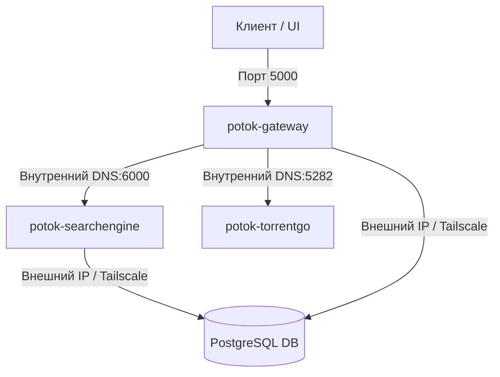

# Potok Backend 🌊

Добро пожаловать в репозиторий бэкенда проекта **Potok**. Здесь находятся исходный код, конфигурационные файлы и инструменты для докеризации и развёртывания всех трёх микросервисов:
1. **Gateway** (BFF, ASP.NET Core) — API-шлюз и точка входа для клиентов.
2. **SearchEngine** (ASP.NET Core) — Движок поиска по торрент-трекерам.
3. **TorrentGo** (Go) — Стриминговый движок на базе BitTorrent.

---

## 🛠️ Архитектура развёртывания (Docker)

Все сервисы упакованы в легковесные контейнеры с поддержкой многоэтапной сборки (Multi-stage builds) для минимизации размера образов. Настройки портов и секреты отделены от кода и конфигурируются через переменные окружения.

### Схема взаимодействия:


---

## 🚀 Быстрый запуск с Docker Compose

Для локального запуска всей связки бэкенда выполните следующие шаги:

### 1. Подготовка конфигурации
В корне папки `backend/Potok.Backend` скопируйте шаблон переменного окружения `.env.example` в `.env`:
```bash
cp .env.example .env
```
Убедитесь, что параметры в `.env` заполнены (по умолчанию файл `.env` предзаполнен только стандартными портами, а строку подключения к базе данных `DATABASE_URL` и API-ключ `GATEWAY_TMDB_API_KEY` вам необходимо указать самостоятельно).

### 2. Сборка и запуск контейнеров
Запустите все сервисы одной командой:
```bash
docker compose up -d --build
```

---

## 📄 Конфигурация `docker-compose.yml`

Ниже представлен готовый конфигурационный файл `docker-compose.yml`, находящийся в корневой директории бэкенда:

```yaml
services:
  # 🌊 Стриминговый движок BitTorrent (TorrentGo)
  potok-torrentgo:
    image: ghcr.io/potok-media/potok-torrentgo:main
    container_name: potok-torrentgo
    restart: unless-stopped
    ports:
      - "${TORRENTGO_PORT:-5282}:${TORRENTGO_PORT:-5282}"
      # ------------------------------------------------------------------------
      # Входящие BitTorrent подключения (DHT/Peer listen port)
      # ------------------------------------------------------------------------
      # - "55123:55123/udp"
      #
      # 💡 ПРИМЕЧАНИЕ ДЛЯ ТЕХ, КТО ЗА NAT / TAILSCALE:
      # Если ваш сервер находится за NAT без проброса портов или подключен через Tailscale,
      # входящие UDP-подключения из внешней сети BitTorrent не смогут дойти напрямую до контейнера.
      # В таком случае этот маппинг бесполезен и должен быть ЗАКОММЕНТИРОВАН.
      # Клиент TorrentGo автоматически перейдет в режим исходящих соединений (outbound-only),
      # чего абсолютно достаточно для стабильного скачивания и стриминга медиафайлов.
      # ------------------------------------------------------------------------
    environment:
      - PORT=${TORRENTGO_PORT:-5282}
    volumes:
      - torrent-cache:/app/torrent-cache

  # 🔍 Поисковый движок по трекерам (SearchEngine)
  potok-searchengine:
    image: ghcr.io/potok-media/potok-searchengine:main
    container_name: potok-searchengine
    restart: unless-stopped
    ports:
      - "${SEARCH_ENGINE_PORT:-6000}:${SEARCH_ENGINE_PORT:-6000}"
    environment:
      - PORT=${SEARCH_ENGINE_PORT:-6000}
      - ConnectionStrings__DefaultConnection=${DATABASE_URL}
    volumes:
      # Монтируем файл конфигурации трекеров для редактирования прямо на хосте без пересборки
      - ./config.yml:/app/config.local.yml

  # 🌐 API-шлюз и BFF (Gateway)
  potok-gateway:
    image: ghcr.io/potok-media/potok-gateway:main
    container_name: potok-gateway
    restart: unless-stopped
    ports:
      - "${GATEWAY_PORT:-5000}:${GATEWAY_PORT:-5000}"
    environment:
      - PORT=${GATEWAY_PORT:-5000}
      - ConnectionStrings__DefaultConnection=${DATABASE_URL}
      - Gateway__TmdbApiKey=${GATEWAY_TMDB_API_KEY}
      - Gateway__DefaultSearchEngineUrl=${GATEWAY_SEARCH_ENGINE_URL:-http://potok-searchengine:6000}
      - Gateway__DefaultTorrServerUrl=${GATEWAY_TORRSERVER_URL:-http://potok-torrentgo:5282}
    depends_on:
      - potok-searchengine
      - potok-torrentgo

volumes:
  torrent-cache:
    name: potok_torrent_cache
```

---

## 🔒 Переменные окружения и Конфигурация (.env)

Мы применили гибридный подход конфигурации в духе методологии Cloud-Native:
1. **Переменные окружения** инжектируют секреты, порты и адреса баз данных. Нативная интеграция в `.NET Core` позволяет переопределять ключи конфигурации с разделителем `__` (двойное подчёркивание) — например, `Gateway__TmdbApiKey` переопределит значение секции `Gateway:TmdbApiKey` в `appsettings.json`.
2. **Файлы конфигураций логики** (такие как `config.local.yml` для поискового движка) монтируются прямо внутрь контейнера через `volumes`. Вы можете спокойно редактировать списки трекеров или настройки кэширования на хост-машине без перезапуска и пересборки Docker-образов!


