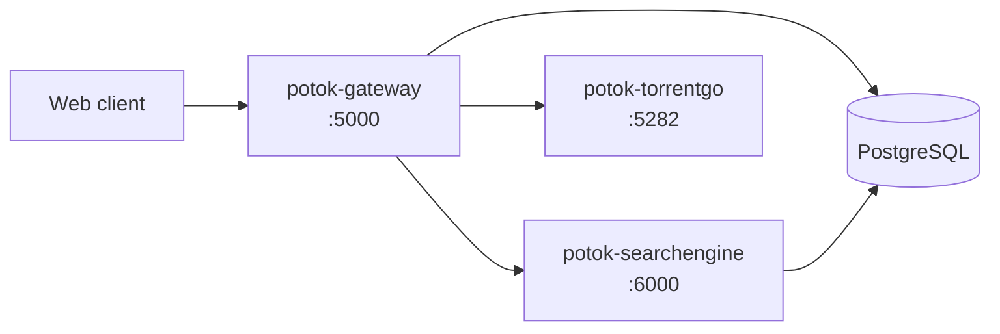

<div align="center">
  

  <h1>Potok Backend</h1>

  **English** · [Русский](./README.ru.md)

  
  
  
  
</div>

Server side of the **Potok** media service — three microservices behind a single API:

- **Gateway** (BFF, ASP.NET Core) — client entry point, auth, TMDB/Trakt proxy, orchestration.
- **SearchEngine** (ASP.NET Core) — torrent search across trackers.
- **TorrentGo** (Go) — BitTorrent streaming engine.

Gateway and SearchEngine share one PostgreSQL (separate schemas); TorrentGo is stateless.
Engine addresses are managed by an external plugin, not by env.

## Architecture



## Quick start (Docker)

```bash
cp .env.example .env          # fill GATEWAY_TMDB_API_KEY and DB credentials
docker compose up -d --build
```

This brings up all three services and a PostgreSQL instance. PostgreSQL is **required**; to
use an external/shared one, set `DB_HOST` and remove the bundled `db` service from
`docker-compose.yml`.

## Services & ports

| Service | Stack | Default port |
|---|---|---|
| `potok-gateway` | ASP.NET Core | `5000` |
| `potok-searchengine` | ASP.NET Core | `6000` |
| `potok-torrentgo` | Go | `5282` |
| `db` (bundled) | PostgreSQL 16 | `5432` |

## Configuration

Set via `.env`. The DB connection string is assembled in `docker-compose.yml` from the
`DB_*` parts, so there is no separate `DATABASE_URL` to keep in sync.

| Variable | Description | Default |
|---|---|---|
| `GATEWAY_TMDB_API_KEY` | TMDB API key (required) | — |
| `GATEWAY_MULTI_USER_MODE` | Allow self-registration of new users | `false` |
| `DB_HOST` / `DB_PORT` | PostgreSQL host/port (`db` = bundled container) | `db` / `5432` |
| `DB_NAME` / `DB_USER` / `DB_PASSWORD` | Database name and credentials | `potok` / `potok` / — |
| `GATEWAY_PORT` / `SEARCH_ENGINE_PORT` / `TORRENTGO_PORT` | Service ports | `5000` / `6000` / `5282` |

Tracker lists for SearchEngine are mounted from `./config.yml` and can be edited on the host
without rebuilding.

> [!NOTE]
> Behind NAT/Tailscale without port forwarding, leave TorrentGo's inbound UDP port commented
> out — it falls back to outbound-only, which is enough for streaming.

## Part of Potok

The backend powers the **Potok** ecosystem:

- ⚙️ **Backend** — this repository (Gateway · SearchEngine · TorrentGo)
- 🌐 **Web** — client
- 🧩 **Plugins & SDK** — extend clients via `PotokSDK`

🔗 [Live](https://potok.rip) · [Wiki](https://potok.rip/wiki) · [GitHub](https://github.com/potok-media)
