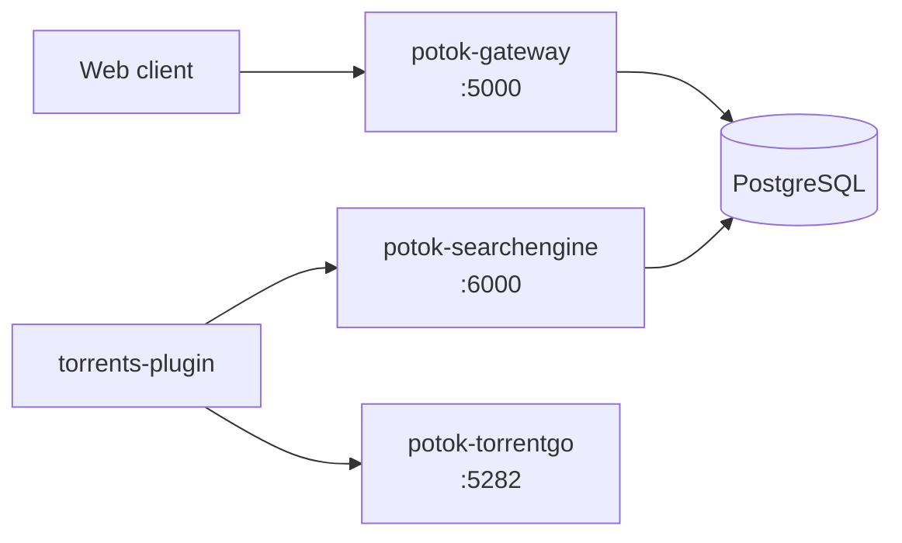

<div align="center">
  

  <h1>Potok Backend</h1>

  **English** · [Русский](./README.ru.md)

  
  
  
  
</div>

Server side of the **Potok** media service — three deployable services:

- **Gateway** (BFF, ASP.NET Core) — client entry point: auth, sync, media (TMDB/Trakt), plugin bundler sidecar, CORS proxy for plugins.
- **SearchEngine** (ASP.NET Core) — torrent search and overrides (for `torrents-plugin`).
- **TorrentGo** (Go) — BitTorrent streaming engine (for `torrents-plugin`).

Gateway and SearchEngine share one PostgreSQL (separate schemas); TorrentGo is stateless.
The client talks to Gateway via `gatewayURL`; the torrents plugin calls SearchEngine and TorrentGo directly.

## Architecture



## Quick start (Docker)

```bash
cp .env.example .env                              # fill GATEWAY_TMDB_API_KEY and DB credentials
cp src/Potok.Backend.SearchEngine/config.yml .    # SearchEngine config (required) — edit trackers
docker compose up -d --build
```

This brings up all three services and a PostgreSQL instance. PostgreSQL is **required**; to
use an external/shared one, set `DB_HOST` and remove the bundled `db` service from
`docker-compose.yml`.

<details>
<summary><code>docker-compose.yml</code></summary>

```yaml
services:
  # 🌐 API gateway / BFF (Gateway)
  potok-gateway:
    image: ghcr.io/potok-media/potok-gateway:latest
    container_name: potok-gateway
    restart: unless-stopped
    ports:
      - "${GATEWAY_PORT:-5000}:${GATEWAY_PORT:-5000}"
    environment:
      - PORT=${GATEWAY_PORT:-5000}
      # Connection string is assembled from the DB_* parts (single source of truth).
      - ConnectionStrings__DefaultConnection=Host=${DB_HOST:-db};Port=${DB_PORT:-5432};Database=${DB_NAME:-potok};Username=${DB_USER:-potok};Password=${DB_PASSWORD:-potok};Timeout=30;CommandTimeout=60;
      - Gateway__TmdbApiKey=${GATEWAY_TMDB_API_KEY}
      - Gateway__MultiUserMode=${GATEWAY_MULTI_USER_MODE:-false}
    depends_on:
      db:
        condition: service_healthy

  # 🔍 Tracker search engine (SearchEngine)
  potok-searchengine:
    image: ghcr.io/potok-media/potok-searchengine:latest
    container_name: potok-searchengine
    restart: unless-stopped
    ports:
      - "${SEARCH_ENGINE_PORT:-6000}:${SEARCH_ENGINE_PORT:-6000}"
    environment:
      - PORT=${SEARCH_ENGINE_PORT:-6000}
      - ConnectionStrings__DefaultConnection=Host=${DB_HOST:-db};Port=${DB_PORT:-5432};Database=${DB_NAME:-potok};Username=${DB_USER:-potok};Password=${DB_PASSWORD:-potok};Timeout=30;CommandTimeout=60;
    volumes:
      # Mount the tracker config so it can be edited on the host without rebuilding.
      - ./config.yml:/app/config.local.yml
    depends_on:
      db:
        condition: service_healthy

  # 🌊 BitTorrent streaming engine (TorrentGo)
  potok-torrentgo:
    image: ghcr.io/potok-media/potok-torrentgo:latest
    container_name: potok-torrentgo
    restart: unless-stopped
    ports:
      - "${TORRENTGO_PORT:-5282}:${TORRENTGO_PORT:-5282}"
      # Inbound BitTorrent UDP port (DHT / peer listen). Behind NAT/Tailscale without port
      # forwarding, leave it commented out — TorrentGo falls back to outbound-only, which is
      # enough for streaming.
      # - "55123:55123/udp"
    environment:
      - PORT=${TORRENTGO_PORT:-5282}

  # 🗄️ PostgreSQL (bundled — required by Gateway and SearchEngine).
  # To use an external/shared database instead, point DB_HOST at it and remove this service.
  db:
    image: postgres:16-alpine
    container_name: potok-db
    restart: unless-stopped
    environment:
      POSTGRES_DB: ${DB_NAME:-potok}
      POSTGRES_USER: ${DB_USER:-potok}
      POSTGRES_PASSWORD: ${DB_PASSWORD:-potok}
    expose:
      - "5432"
    ports:
      - "${DB_PORT:-5432}:5432"
    volumes:
      - potok-db:/var/lib/postgresql/data
    healthcheck:
      test: ["CMD-SHELL", "pg_isready -U ${DB_USER:-potok} -d ${DB_NAME:-potok}"]
      interval: 10s
      timeout: 5s
      retries: 5
      start_period: 30s

volumes:
  potok-db:
    name: potok_db
```

</details>

## Services & ports

| Service | Stack | Default port |
|---|---|---|
| `potok-gateway` | ASP.NET Core | `5000` |
| `potok-searchengine` | ASP.NET Core | `6000` |
| `potok-torrentgo` | Go | `5282` |
| `db` (bundled) | PostgreSQL 16 | `5432` |

## Configuration

Set via `.env`. The DB connection string is assembled in `docker-compose.yml` from the
`DB_*` parts, so there is no separate `DATABASE_URL` to keep in sync.

| Variable | Description | Default |
|---|---|---|
| `GATEWAY_TMDB_API_KEY` | TMDB API key (required) | — |
| `GATEWAY_MULTI_USER_MODE` | Allow self-registration of new users | `false` |
| `DB_HOST` / `DB_PORT` | PostgreSQL host/port (`db` = bundled container) | `db` / `5432` |
| `DB_NAME` / `DB_USER` / `DB_PASSWORD` | Database name and credentials | `potok` / `potok` / — |
| `GATEWAY_PORT` / `SEARCH_ENGINE_PORT` / `TORRENTGO_PORT` | Service ports | `5000` / `6000` / `5282` |

### SearchEngine config (`config.yml`)

SearchEngine also needs its own YAML config — **it won't start without it**. The compose mounts
`./config.yml` (next to `docker-compose.yml`) into the container as `config.local.yml`, so you
can edit it on the host without rebuilding. It configures the server, result merging, cache,
periodic refresh, ffprobe, and the **trackers** (which to search, popularity crawling, and
per-tracker credentials where required).

Grab the sample to start from:

```bash
cp src/Potok.Backend.SearchEngine/config.yml ./config.yml   # then edit trackers/credentials
```

<details>
<summary><code>config.yml</code> (SearchEngine sample — empty credentials)</summary>

```yaml
##### Server
listen-ip: any
api-key: ''
web: true

##### Result output

# Same infohash → treat as one torrent; merge metadata (seeders/leechers, sizes, names, links).
merge-duplicates: true

# Also collapse such duplicates when only a number/suffix differs (Release, Release (1),
# Release-2) and the infohash matches. Useful for TV shows / anime.
merge-num-duplicates: true

cache:
  enable: true        # cache fetched data
  expiry: 15          # cache TTL (min)
  auth-expiry: 1      # auth data TTL (days)

refresh:
  enable: true        # periodically refresh torrent data
  timeout: 1440       # run interval (min)
  older-than-min: 180 # refresh torrents older than this (min)
  limit: 50           # torrents per pass

# ffprobe / audio languages via TorrServer
ffprobe:
  enable: true
  timeout: 60
  tsuri: ''
  batch-size: 20      # torrents processed per batch
  attempts: 3         # max ffprobe attempts per torrent
  authorization:
    login: ''
    password: ''

##### Trackers

rutracker:
  enable-search: true

  # Crawl popular releases by category
  popular:
    enable: false     # on/off
    timeout: 600      # delay (min)
    max-pages: 3      # crawl depth per category
    categories:       # categories to parse (e.g. [549, 22, 1666])
      [ 1106, 1105, 2491, 1389 ]

  authorization:
    login: ''
    password: ''

animelayer:
  enable-search: true
  authorization:
    login: ''
    password: ''

nnmclub:
  enable-search: true

rutor:
  enable-search: true

aniliberty:
  enable-search: true

kinozal:
  enable-search: true
  authorization:
    login: ''
    password: ''

megapeer:
  enable-search: true

proxy:
  list:
    - url: ''
      username: ''
      password: ''
```

</details>

> [!NOTE]
> Behind NAT/Tailscale without port forwarding, leave TorrentGo's inbound UDP port commented
> out — it falls back to outbound-only, which is enough for streaming.

## Part of Potok

The backend powers the **Potok** ecosystem:

- ⚙️ **Backend** — this repository (Gateway · SearchEngine · TorrentGo)
- 🌐 **Web** — client
- 🧩 **Plugins & SDK** — extend clients via `PotokSDK`

🔗 [Live](https://potok.rip) · [Wiki](https://potok.rip/wiki) · [GitHub](https://github.com/potok-media)
