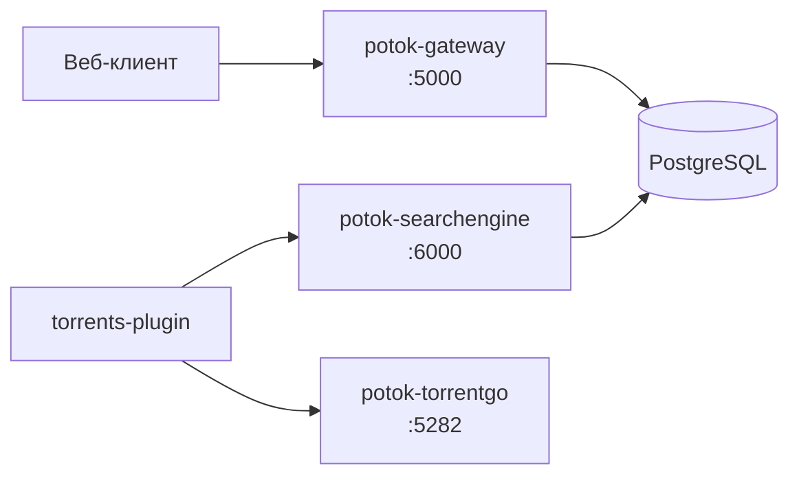

<div align="center">
  

  <h1>Бэкенд Potok</h1>

  [English](./README.md) · **Русский**

  
  
  
  
</div>

Серверная часть медиа-сервиса **Potok** — три deployable-сервиса:

- **Gateway** (BFF, ASP.NET Core) — точка входа для клиентов: auth, sync, media (TMDB/Trakt), plugin bundler sidecar, CORS-proxy для плагинов.
- **SearchEngine** (ASP.NET Core) — поиск торрентов и overrides (для `torrents-plugin`).
- **TorrentGo** (Go) — стриминговый движок BitTorrent (для `torrents-plugin`).

Gateway и SearchEngine используют одну PostgreSQL (разные схемы); TorrentGo stateless.
Клиент ходит в Gateway по `gatewayURL`; плагин торрентов — напрямую в SearchEngine и TorrentGo.

## Архитектура



## Быстрый старт (Docker)

Создайте в одной папке `docker-compose.yml`, `.env` и (для торрентов) `config.yml` — [вики, установка](https://potok.rip/wiki). Затем:

```bash
docker compose up -d --build
```

Минимальный `.env`:

```env
GATEWAY_PORT=5000
GATEWAY_TMDB_API_KEY=ваш_ключ_tmdb
GATEWAY_JWT_SECRET=change-me-in-production-32chars-min
DB_HOST=db
DB_PASSWORD=changeme
SEARCH_ENGINE_PORT=6000
TORRENTGO_PORT=5282
```

Поднимутся все три сервиса и экземпляр PostgreSQL. База **обязательна**; чтобы использовать
внешнюю/общую, задайте `DB_HOST` и удалите встроенный сервис `db` из `docker-compose.yml`.

<details>
<summary><code>docker-compose.yml</code></summary>

```yaml
services:
  # 🌐 API gateway / BFF (Gateway)
  potok-gateway:
    image: ghcr.io/potok-media/potok-gateway:latest
    container_name: potok-gateway
    restart: unless-stopped
    ports:
      - "${GATEWAY_PORT:-5000}:${GATEWAY_PORT:-5000}"
    environment:
      - PORT=${GATEWAY_PORT:-5000}
      # Строка подключения собирается из частей DB_* (единый источник истины).
      - ConnectionStrings__DefaultConnection=Host=${DB_HOST:-db};Port=${DB_PORT:-5432};Database=${DB_NAME:-potok};Username=${DB_USER:-potok};Password=${DB_PASSWORD:-potok};Timeout=30;CommandTimeout=60;
      - Gateway__TmdbApiKey=${GATEWAY_TMDB_API_KEY:-${TMDB_API_KEY:-2c4fa42c601c29b6fea7ad9b211c46f0}}
      - Gateway__MultiUserMode=${GATEWAY_MULTI_USER_MODE:-false}
      - Gateway__JwtSecret=${GATEWAY_JWT_SECRET:-default-fallback-gateway-jwt-secret-key-32-chars-long}
    depends_on:
      db:
        condition: service_healthy

  # 🔍 Поисковый движок по трекерам (SearchEngine)
  potok-searchengine:
    image: ghcr.io/potok-media/potok-searchengine:latest
    container_name: potok-searchengine
    restart: unless-stopped
    ports:
      - "${SEARCH_ENGINE_PORT:-6000}:${SEARCH_ENGINE_PORT:-6000}"
    environment:
      - PORT=${SEARCH_ENGINE_PORT:-6000}
      - ConnectionStrings__DefaultConnection=Host=${DB_HOST:-db};Port=${DB_PORT:-5432};Database=${DB_NAME:-potok};Username=${DB_USER:-potok};Password=${DB_PASSWORD:-potok};Timeout=30;CommandTimeout=60;
    volumes:
      # Монтируем конфиг трекеров — редактируется на хосте без пересборки.
      - ./config.yml:/app/config.local.yml
    depends_on:
      db:
        condition: service_healthy

  # 🌊 Стриминговый движок BitTorrent (TorrentGo)
  potok-torrentgo:
    image: ghcr.io/potok-media/potok-torrentgo:latest
    container_name: potok-torrentgo
    restart: unless-stopped
    ports:
      - "${TORRENTGO_PORT:-5282}:${TORRENTGO_PORT:-5282}"
      # Входящий UDP-порт BitTorrent (DHT / приём пиров). За NAT/Tailscale без проброса
      # оставьте закомментированным — TorrentGo перейдёт в outbound-only, для стриминга достаточно.
      # - "55123:55123/udp"
    environment:
      - PORT=${TORRENTGO_PORT:-5282}

  # 🗄️ PostgreSQL (встроенная — нужна Gateway и SearchEngine).
  # Чтобы использовать внешнюю/общую БД — укажите её в DB_HOST и удалите этот сервис.
  db:
    image: postgres:16-alpine
    container_name: potok-db
    restart: unless-stopped
    environment:
      POSTGRES_DB: ${DB_NAME:-potok}
      POSTGRES_USER: ${DB_USER:-potok}
      POSTGRES_PASSWORD: ${DB_PASSWORD:-potok}
    expose:
      - "5432"
    ports:
      - "${DB_PORT:-5432}:5432"
    volumes:
      - potok-db:/var/lib/postgresql/data
    healthcheck:
      test: ["CMD-SHELL", "pg_isready -U ${DB_USER:-potok} -d ${DB_NAME:-potok}"]
      interval: 10s
      timeout: 5s
      retries: 5
      start_period: 30s

volumes:
  potok-db:
    name: potok_db
```

</details>

## Сервисы и порты

| Сервис | Стек | Порт по умолчанию |
|---|---|---|
| `potok-gateway` | ASP.NET Core | `5000` |
| `potok-searchengine` | ASP.NET Core | `6000` |
| `potok-torrentgo` | Go | `5282` |
| `db` (встроенная) | PostgreSQL 16 | `5432` |

## Конфигурация

Задаётся через `.env`. Строка подключения к БД собирается в `docker-compose.yml` из частей
`DB_*`, поэтому отдельного `DATABASE_URL` держать в синхроне не нужно.

| Переменная | Куда попадает | Описание | По умолчанию |
|---|---|---|---|
| `GATEWAY_TMDB_API_KEY` | `Gateway__TmdbApiKey` | Ключ TMDB API — необязательно; принимает и `TMDB_API_KEY`, при отсутствии используется общий дефолт | встроенный |
| `GATEWAY_MULTI_USER_MODE` | `Gateway__MultiUserMode` | Саморегистрация пользователей | `false` |
| `GATEWAY_JWT_SECRET` | `Gateway__JwtSecret` | Секрет JWT (смените в продакшене) | смените в продакшене |
| `DB_HOST` / `DB_PORT` | строка подключения | Хост/порт PostgreSQL (`db` = встроенный) | `db` / `5432` |
| `DB_NAME` / `DB_USER` / `DB_PASSWORD` | строка подключения + сервис `db` | Доступы к БД | `potok` / `potok` / — |
| `GATEWAY_PORT` | `PORT` в gateway | Порт публикации на хосте | `5000` |
| `SEARCH_ENGINE_PORT` | `PORT` в searchengine | Порт на хосте; укажите тот же URL в `searchEngineURL` плагина | `6000` |
| `TORRENTGO_PORT` | `PORT` в torrentgo | Порт на хосте; укажите тот же URL в `torrentGoURL` плагина | `5282` |
| `GPU_DEVICE` | `devices:` в compose | Проброс GPU для TorrentGo (**не** env-переменная процесса) | noop `/dev/null` |
| `POTOK_DISABLE_HWACCEL` | env torrentgo (добавить вручную) | Принудительный софтверный транскод при `1` | выкл. |

**Не через `.env`:** креды трекеров SearchEngine — в `config.yml` (монтируется как `config.local.yml`). Порт SearchEngine — `PORT` / `SEARCH_ENGINE_PORT`, не `config.yml`. URL плагина (`searchEngineURL`, `torrentGoURL`) задаются в potok-torrents, не в env Gateway.

### Конфиг SearchEngine (`config.yml`)

SearchEngine нужен `./config.yml` рядом с `docker-compose.yml` (монтируется как `config.local.yml`).
Создайте на хосте и заполните трекеры — копировать из репозитория не обязательно.

Подробно: [SearchEngine и TorrentGo](https://potok.rip/wiki) (раздел в сайдбаре вики). Образец структуры:
[`src/Potok.Backend.SearchEngine/config.yml`](src/Potok.Backend.SearchEngine/config.yml).

> [!NOTE]
> За NAT/Tailscale без проброса портов оставьте входящий UDP-порт TorrentGo закомментированным —
> он перейдёт в режим outbound-only, чего достаточно для стриминга.

## Часть Potok

Бэкенд — основа экосистемы **Potok**:

- ⚙️ **Backend** — этот репозиторий (Gateway · SearchEngine · TorrentGo)
- 🌐 **Web** — клиент
- 🧩 **Плагины и SDK** — расширение клиентов через `PotokSDK`

🔗 [Сайт](https://potok.rip) · [Вики](https://potok.rip/wiki) · [GitHub](https://github.com/potok-media)
