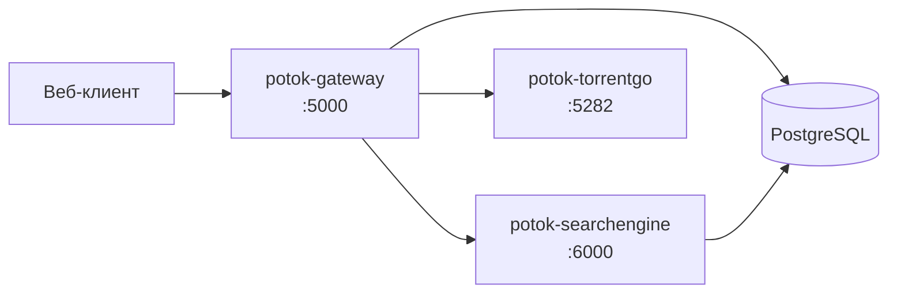

<div align="center">
  

  <h1>Бэкенд Potok</h1>

  [English](./README.md) · **Русский**

  
  
  
  
</div>

Серверная часть медиа-сервиса **Potok** — три микросервиса за единым API:

- **Gateway** (BFF, ASP.NET Core) — точка входа для клиентов, авторизация, прокси TMDB/Trakt, оркестрация.
- **SearchEngine** (ASP.NET Core) — поиск торрентов по трекерам.
- **TorrentGo** (Go) — стриминговый движок BitTorrent.

Gateway и SearchEngine используют одну PostgreSQL (разные схемы); TorrentGo stateless.
Адреса движков задаются внешним плагином, а не через env.

## Архитектура



## Быстрый старт (Docker)

```bash
cp .env.example .env                              # заполните GATEWAY_TMDB_API_KEY и доступы к БД
cp src/Potok.Backend.SearchEngine/config.yml .    # конфиг SearchEngine (обязателен) — настройте трекеры
docker compose up -d --build
```

Поднимутся все три сервиса и экземпляр PostgreSQL. База **обязательна**; чтобы использовать
внешнюю/общую, задайте `DB_HOST` и удалите встроенный сервис `db` из `docker-compose.yml`.

<details>
<summary><code>docker-compose.yml</code></summary>

```yaml
services:
  # 🌐 API gateway / BFF (Gateway)
  potok-gateway:
    image: ghcr.io/potok-media/potok-gateway:latest
    container_name: potok-gateway
    restart: unless-stopped
    ports:
      - "${GATEWAY_PORT:-5000}:${GATEWAY_PORT:-5000}"
    environment:
      - PORT=${GATEWAY_PORT:-5000}
      # Строка подключения собирается из частей DB_* (единый источник истины).
      - ConnectionStrings__DefaultConnection=Host=${DB_HOST:-db};Port=${DB_PORT:-5432};Database=${DB_NAME:-potok};Username=${DB_USER:-potok};Password=${DB_PASSWORD:-potok};Timeout=30;CommandTimeout=60;
      - Gateway__TmdbApiKey=${GATEWAY_TMDB_API_KEY}
      - Gateway__MultiUserMode=${GATEWAY_MULTI_USER_MODE:-false}
    depends_on:
      db:
        condition: service_healthy

  # 🔍 Поисковый движок по трекерам (SearchEngine)
  potok-searchengine:
    image: ghcr.io/potok-media/potok-searchengine:latest
    container_name: potok-searchengine
    restart: unless-stopped
    ports:
      - "${SEARCH_ENGINE_PORT:-6000}:${SEARCH_ENGINE_PORT:-6000}"
    environment:
      - PORT=${SEARCH_ENGINE_PORT:-6000}
      - ConnectionStrings__DefaultConnection=Host=${DB_HOST:-db};Port=${DB_PORT:-5432};Database=${DB_NAME:-potok};Username=${DB_USER:-potok};Password=${DB_PASSWORD:-potok};Timeout=30;CommandTimeout=60;
    volumes:
      # Монтируем конфиг трекеров — редактируется на хосте без пересборки.
      - ./config.yml:/app/config.local.yml
    depends_on:
      db:
        condition: service_healthy

  # 🌊 Стриминговый движок BitTorrent (TorrentGo)
  potok-torrentgo:
    image: ghcr.io/potok-media/potok-torrentgo:latest
    container_name: potok-torrentgo
    restart: unless-stopped
    ports:
      - "${TORRENTGO_PORT:-5282}:${TORRENTGO_PORT:-5282}"
      # Входящий UDP-порт BitTorrent (DHT / приём пиров). За NAT/Tailscale без проброса
      # оставьте закомментированным — TorrentGo перейдёт в outbound-only, для стриминга достаточно.
      # - "55123:55123/udp"
    environment:
      - PORT=${TORRENTGO_PORT:-5282}

  # 🗄️ PostgreSQL (встроенная — нужна Gateway и SearchEngine).
  # Чтобы использовать внешнюю/общую БД — укажите её в DB_HOST и удалите этот сервис.
  db:
    image: postgres:16-alpine
    container_name: potok-db
    restart: unless-stopped
    environment:
      POSTGRES_DB: ${DB_NAME:-potok}
      POSTGRES_USER: ${DB_USER:-potok}
      POSTGRES_PASSWORD: ${DB_PASSWORD:-potok}
    expose:
      - "5432"
    ports:
      - "${DB_PORT:-5432}:5432"
    volumes:
      - potok-db:/var/lib/postgresql/data
    healthcheck:
      test: ["CMD-SHELL", "pg_isready -U ${DB_USER:-potok} -d ${DB_NAME:-potok}"]
      interval: 10s
      timeout: 5s
      retries: 5
      start_period: 30s

volumes:
  potok-db:
    name: potok_db
```

</details>

## Сервисы и порты

| Сервис | Стек | Порт по умолчанию |
|---|---|---|
| `potok-gateway` | ASP.NET Core | `5000` |
| `potok-searchengine` | ASP.NET Core | `6000` |
| `potok-torrentgo` | Go | `5282` |
| `db` (встроенная) | PostgreSQL 16 | `5432` |

## Конфигурация

Задаётся через `.env`. Строка подключения к БД собирается в `docker-compose.yml` из частей
`DB_*`, поэтому отдельного `DATABASE_URL` держать в синхроне не нужно.

| Переменная | Описание | По умолчанию |
|---|---|---|
| `GATEWAY_TMDB_API_KEY` | Ключ TMDB API (обязательно) | — |
| `GATEWAY_MULTI_USER_MODE` | Разрешить саморегистрацию новых пользователей | `false` |
| `DB_HOST` / `DB_PORT` | Хост/порт PostgreSQL (`db` = встроенный контейнер) | `db` / `5432` |
| `DB_NAME` / `DB_USER` / `DB_PASSWORD` | Имя БД и доступы | `potok` / `potok` / — |
| `GATEWAY_PORT` / `SEARCH_ENGINE_PORT` / `TORRENTGO_PORT` | Порты сервисов | `5000` / `6000` / `5282` |

### Конфиг SearchEngine (`config.yml`)

У SearchEngine есть собственный YAML-конфиг — **без него движок не стартует**. Compose монтирует
хостовый `./config.yml` (рядом с `docker-compose.yml`) в контейнер как `config.local.yml`, так что
его можно править на хосте без пересборки. В нём настраиваются сервер, объединение результатов,
кэш, периодический refresh, ffprobe и **трекеры** (какие искать, обход популярного и креды для
тех трекеров, где они нужны).

Возьмите образец за основу:

```bash
cp src/Potok.Backend.SearchEngine/config.yml ./config.yml   # затем настройте трекеры/креды
```

<details>
<summary><code>config.yml</code> (образец SearchEngine — креды пустые)</summary>

```yaml
##### настройка сервера
listen-ip: any
api-key: ''
web: true

##### настройка выдачи

# если у раздач одинаковый infohash, считаем это один торрент; объединяем их метаданные (сид/личи, размеры, названия, ссылки) в одну итоговую запись.
merge-duplicates: true

# дополнительно схлопывает те же дубликаты, когда отличаются лишь номер/суффикс в названии (Release, Release (1), Release-2), если infohash совпадает; метаданные так же объединяются.
# работает для сериалов/аниме и похожего контента
merge-num-duplicates: true

cache:
  enable: true        # включение сохранения данных в кеш
  expiry: 15          # срок жизни данных в кеше (мин)
  auth-expiry: 1      # срок жизни аутентификационных данных в кеше (дни)

refresh:
  enable: true        # Включить обновление данных торрентов
  timeout: 1440         # Интервал запуска сервиса (мин)
  older-than-min: 180  # Обновлять торренты старше 60 минут
  limit: 50           # Лимит торрентов за проход

# ffprobe/языки через TorrServer
ffprobe:
  enable: true
  timeout: 60
  tsuri: ''
  batch-size: 20 # кол-во торрентов для обработки за раз
  attempts: 3 # максимальное кол-во попыток получения ffprobe для одного торрента
  authorization:
    login: ''
    password: ''

##### настройка трекеров

rutracker:
  enable-search: true

  # Обновление популярных раздач по категориям
  popular:
    enable: false # включить/выключить
    timeout: 600 # задержка в минутах
    max-pages: 3 # глубина обхода в каждой категории
    categories: # список категорий для парсинга (например: [549, 22, 1666])
      [ 1106, 1105, 2491, 1389 ]

  authorization:
    login: ''
    password: ''

animelayer:
  enable-search: true
  authorization:
    login: ''
    password: ''

nnmclub:
  enable-search: true

rutor:
  enable-search: true

aniliberty:
  enable-search: true

kinozal:
  enable-search: true

  authorization:
    login: ''
    password: ''

megapeer:
  enable-search: true

proxy:
  list:
    - url: ''
      username: ''
      password: ''
```

</details>

> [!NOTE]
> За NAT/Tailscale без проброса портов оставьте входящий UDP-порт TorrentGo закомментированным —
> он перейдёт в режим outbound-only, чего достаточно для стриминга.

## Часть Potok

Бэкенд — основа экосистемы **Potok**:

- ⚙️ **Backend** — этот репозиторий (Gateway · SearchEngine · TorrentGo)
- 🌐 **Web** — клиент
- 🧩 **Плагины и SDK** — расширение клиентов через `PotokSDK`

🔗 [Сайт](https://potok.rip) · [Вики](https://potok.rip/wiki) · [GitHub](https://github.com/potok-media)
