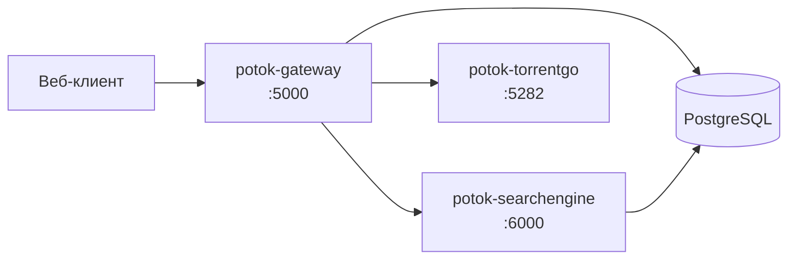

<div align="center">
  

  <h1>Бэкенд Potok</h1>

  [English](./README.md) · **Русский**

  
  
  
  
</div>

Серверная часть медиа-сервиса **Potok** — три микросервиса за единым API:

- **Gateway** (BFF, ASP.NET Core) — точка входа для клиентов, авторизация, прокси TMDB/Trakt, оркестрация.
- **SearchEngine** (ASP.NET Core) — поиск торрентов по трекерам.
- **TorrentGo** (Go) — стриминговый движок BitTorrent.

Gateway и SearchEngine используют одну PostgreSQL (разные схемы); TorrentGo stateless.
Адреса движков задаются внешним плагином, а не через env.

## Архитектура



## Быстрый старт (Docker)

```bash
cp .env.example .env          # заполните GATEWAY_TMDB_API_KEY и доступы к БД
docker compose up -d --build
```

Поднимутся все три сервиса и экземпляр PostgreSQL. База **обязательна**; чтобы использовать
внешнюю/общую, задайте `DB_HOST` и удалите встроенный сервис `db` из `docker-compose.yml`.

## Сервисы и порты

| Сервис | Стек | Порт по умолчанию |
|---|---|---|
| `potok-gateway` | ASP.NET Core | `5000` |
| `potok-searchengine` | ASP.NET Core | `6000` |
| `potok-torrentgo` | Go | `5282` |
| `db` (встроенная) | PostgreSQL 16 | `5432` |

## Конфигурация

Задаётся через `.env`. Строка подключения к БД собирается в `docker-compose.yml` из частей
`DB_*`, поэтому отдельного `DATABASE_URL` держать в синхроне не нужно.

| Переменная | Описание | По умолчанию |
|---|---|---|
| `GATEWAY_TMDB_API_KEY` | Ключ TMDB API (обязательно) | — |
| `GATEWAY_MULTI_USER_MODE` | Разрешить саморегистрацию новых пользователей | `false` |
| `DB_HOST` / `DB_PORT` | Хост/порт PostgreSQL (`db` = встроенный контейнер) | `db` / `5432` |
| `DB_NAME` / `DB_USER` / `DB_PASSWORD` | Имя БД и доступы | `potok` / `potok` / — |
| `GATEWAY_PORT` / `SEARCH_ENGINE_PORT` / `TORRENTGO_PORT` | Порты сервисов | `5000` / `6000` / `5282` |

Списки трекеров для SearchEngine монтируются из `./config.yml` и редактируются на хосте без пересборки.

> [!NOTE]
> За NAT/Tailscale без проброса портов оставьте входящий UDP-порт TorrentGo закомментированным —
> он перейдёт в режим outbound-only, чего достаточно для стриминга.

## Часть Potok

Бэкенд — основа экосистемы **Potok**:

- ⚙️ **Backend** — этот репозиторий (Gateway · SearchEngine · TorrentGo)
- 🌐 **Web** — клиент
- 🧩 **Плагины и SDK** — расширение клиентов через `PotokSDK`

🔗 [Сайт](https://potok.rip) · [Вики](https://potok.rip/wiki) · [GitHub](https://github.com/potok-media)
